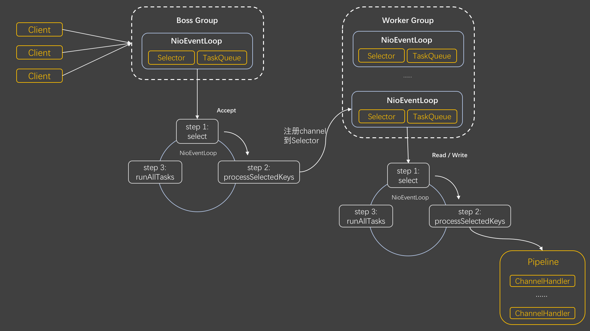

# Netty
## 核心概念介绍

### Bootstrap 和 ServerBootstrap

用于配置客户端和服务端的引导类。ServerBootstrap 用于服务器端启动，而 Bootstrap 则用于客户端启动。

### EventLoopGroup
管理一组线程（通常是非阻塞的多路复用器），负责监听并分发事件。
对于服务端来说，一般会有两个 EventLoopGroup，一个是用于接受新连接的 boss group，另一个是用于处理已建立连接的 worker group。

### EventLoop

每个 **EventLoop**  通常关联着一个或多个线程（Executor），这些线程可以被多个 `Channel` 共享使用。

当一个  Channel  被创建时，它会被分配给某个 EventLoop，这个 EventLoop 将负责该 Channel 的所有后续 I/O 操作。

### Channel

Channel 用于表示与网络实体的连接，并进行数据的读写及连接的关闭。
- bind()
- connect()
- read()
- write()

Channel  与其余组件的关系：

1. 与 EventLoop 关联：每个 Channel 都与一个 EventLoop 相关联，EventLoop 负责处理 Channel 的 I/O 事件，确保事件的处理在正确的线程中进行。

   【事件类型】：Channel 会产生各种事件，如连接激活、连接断开、数据读取完成、异常发生等。这些事件会被发送到 ChannelPipeline 中，由相应的ChannelHandler 进行处理。

2. Channel  位于 ChannelPipeline 中：Channel被分配到一个专属的 ChannelPipeline，ChannelPipeline 中的 ChannelHandler 通过处理 Channel 上的事件来实现应用程序的业务逻辑。

   当一个事件发生时，它会从 ChannelPipeline 的头部开始传播，依次经过每个 ChannelHandler，直到到达尾部。

   每个ChannelHandler可以根据自己的需求处理事件，也可以将事件传递给下一个ChannelHandler。

### ChannelPipeline

每个 Channel 都有一个与之对应的 ChannelHandler 链表。

### ChannelHandler

用于处理各种事件或操作的接口。ChannelHandlerContext 是 ChannelHandler 与 ChannelPipeline 之间的桥梁。

